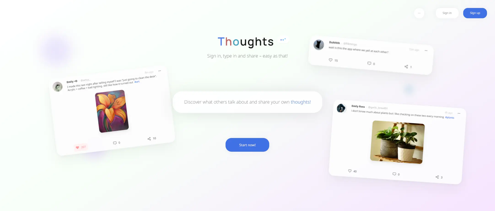

## Thoughts
A social media prototype recreating known mainstream platform concepts from scratch.



### Stack used
- **Vite** - build tool and development server.
- **SvelteKit** - frontend & backend.
- **Sharp** - server-side image processing. 
- **howler.js** - web audio management.
- **Tailwind CSS** - styling of the user interface.
- **PostgreSQL** (handled by **TypeORM**) - persistent storage.
- **WebSocket** - realtime communication (e.g. messaging, notification service).

### Requirements
- Node.js / Bun
- Docker

### Setting-up & Running
1. **Clone this repository**
2. **Configure `.env` file**
3. **Start containerized services:**
   - `docker compose up -d`
4. **Initialize database structure:**
   - `npm run db:migrate:initial`
5. **Run development server:**
   - `npm run dev`

### Stopping application
1. **Stop the development server:**
   - Press `Ctrl + C` in the terminal running the server.
2. **Shut down the containerized services:**
   - Run the command to shut down containerized services:
   ```bash
   docker compose down
   ```

### Testing
*One can run tests with respective commands:*
- **E2E:** `npm run test:e2e`
- **Unit:** `npm run test:unit`
